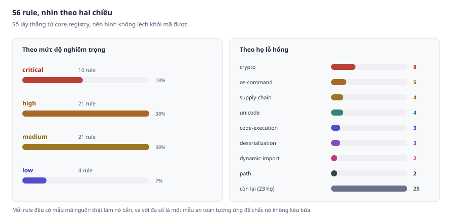
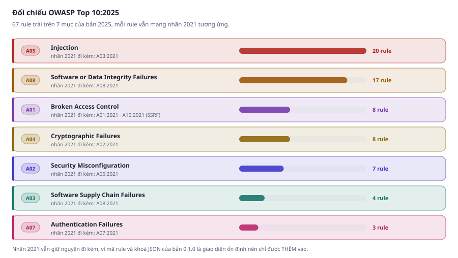
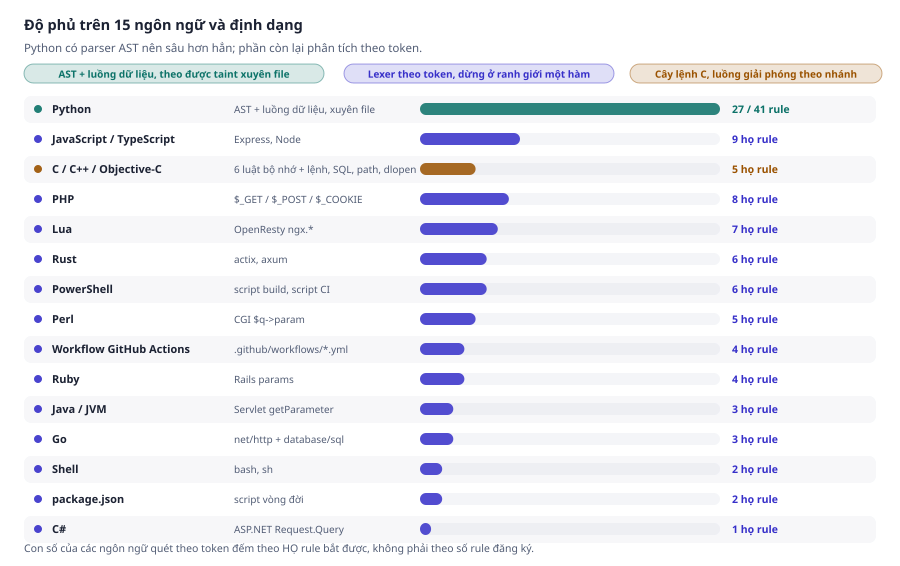
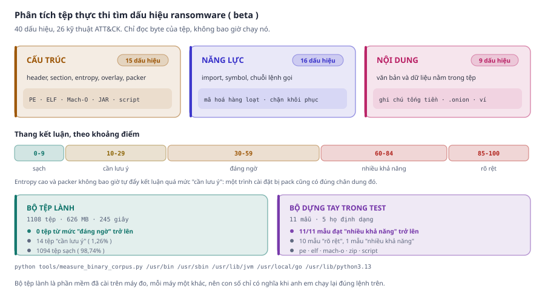
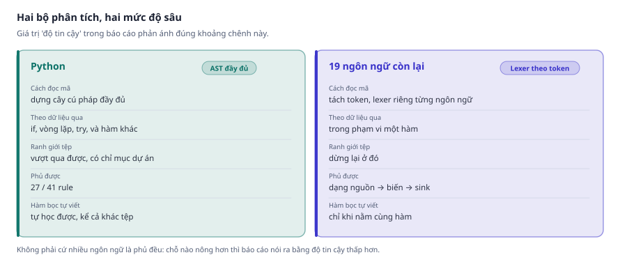

<div align="center">

# 🛡️ Fortress Scan Basic Injection

**Công cụ phân tích tĩnh phát hiện sớm lỗ hổng injection trong mã nguồn.**
Giao diện và báo cáo **hoàn toàn bằng tiếng Việt** cho anh em.

[](CHANGELOG.md)
[](LICENSE)
[](https://www.python.org/)
[](pyproject.toml)

[](#-67-rule-trên-34-họ-lỗ-hổng)
[](#-67-rule-trên-34-họ-lỗ-hổng)
[](#-quét-được-những-dự-án-nào-)
[](tests/)
[](#-đối-chiếu-owasp-top-102025)
[](#-chỉ-đọc-và-in-báo-cáo-không-làm-gì-khác-)

</div>

---

## ⚡ Bắt đầu trong 30 giây

```bash
git clone https://github.com/fortress07/fortress-scan-basic-injection
cd fortress-scan-basic-injection
pip install -e .

python -m fortress_scan ./du-an-cua-toi -v
```

Kết quả trông như thế này:

```
app/routes.py
   CRIT  42:4   Dữ liệu không tin cậy được nối thẳng vào câu lệnh SQL
        tham số truy vấn HTTP chạy tới cursor.execute() mà chưa được vô hiệu hóa
        FSB-SQL-001 | độ tin cậy high | CWE-89
        cursor.execute(f"SELECT * FROM users WHERE name = '{name}'")
        đường đi của dữ liệu:
          dòng 40  tham số truy vấn HTTP đi vào từ đây
          dòng 40  chảy vào biến name
          dòng 42  chạy tới cursor.execute()
```

> [!NOTE]
> Fortress Scan **không dò từ khoá** kiểu grep tên hàm. Nó truy ngược **đường đi của dữ liệu**
> từ nơi đi vào tới nơi phát nổ, rồi in ra cả đường đi để anh em tự kiểm chứng.

---

## 🎯 Công cụ này làm gì

<picture>
  <source media="(prefers-color-scheme: dark)" srcset="docs/img/taint-flow-dark.svg">
  
</picture>

Chỉ khi dữ liệu bẩn **tới được sink mà chưa bị vô hiệu hoá** thì mới thành một phát hiện, và báo
cáo in ra **cả đường đi** để anh em tự kiểm chứng chứ không bắt phải tin tuyệt đối.

---

## 📊 Bản 0.1.0 bằng những con số

<table>
<tr>
<td align="center"><b>67</b><br/><sub>rule</sub></td>
<td align="center"><b>34</b><br/><sub>họ lỗ hổng</sub></td>
<td align="center"><b>14</b><br/><sub>ngôn ngữ &amp; định dạng</sub></td>
<td align="center"><b>2149</b><br/><sub>kiểm tra tự động</sub></td>
<td align="center"><b>0</b><br/><sub>phụ thuộc ngoài</sub></td>
</tr>
</table>

<picture>
  <source media="(prefers-color-scheme: dark)" srcset="docs/img/rules-dark.svg">
  
</picture>

---

## 🛡️ Đối chiếu OWASP Top 10:2025

Bản 0.1.0 gắn nhãn theo **OWASP Top 10:2025**, và giữ luôn nhãn **2021** đi kèm vì nhiều nơi
( báo cáo tuân thủ, bảng điều khiển code scanning ) vẫn đang tính theo bản cũ. Cả hai đều có mặt
trong JSON và SARIF nên anh em lọc theo bản nào cũng được.

<picture>
  <source media="(prefers-color-scheme: dark)" srcset="docs/img/owasp-2025-dark.svg">
  
</picture>

| OWASP Top 10:2025 | Rule của Fortress Scan | Nhãn 2021 đi kèm |
| :--- | :--- | :--- |
| 🟣 **A01 Broken Access Control** | `FSB-ACCESS-001` ( quyền quyết định bằng trường người gửi tự đặt ) · `FSB-PATH-001` · `FSB-PATH-002` ( zip slip ) · `FSB-REDIR-001` · `FSB-SSRF-001` | A01:2021, và A10:2021 cho SSRF |
| 🔵 **A02 Security Misconfiguration** | `FSB-XML-001` ( XXE ) · `FSB-CORS-001` ( CORS mở kèm credentials ) · `FSB-COOKIE-001` ( cookie phiên thiếu HttpOnly ) · `FSB-PERM-001` ( quyền tệp ) · `FSB-TMP-001` ( tệp tạm ) · `FSB-DEBUG-001` ( chế độ gỡ lỗi ) | A05:2021 |
| 🟢 **A03 Software Supply Chain Failures** | `FSB-SUP-001` · `FSB-SUP-002` · `FSB-CI-003` · `FSB-CI-004` | A08:2021 |
| 🟡 **A04 Cryptographic Failures** | `FSB-CRYPTO-001` … `FSB-CRYPTO-008`: hàm băm và thuật toán đã bị phá, ECB, IV/nonce/muối hằng, khoá viết cứng, PRNG đoán được, khoá RSA ngắn | A02:2021 |
| 🔴 **A05 Injection** | 20 rule: SQL, OS command, code, template, LDAP, XPath, NoSQL, XSS, EL, reflection, header, file inclusion, CI expression | A03:2021 |
| 💗 **A07 Authentication Failures** | `FSB-TLS-001` ( tắt xác minh chứng chỉ ) · `FSB-SECRET-001` ( mật khẩu, token viết cứng ) · `FSB-JWT-001` ( JWT không xác minh chữ ký ) | A07:2021 |
| 🟠 **A08 Software or Data Integrity Failures** | `FSB-DESER-*` · `FSB-UNI-*` · `FSB-IMPORT-002` · `FSB-MASS-001` ( mass assignment ) · `FSB-PROTO-001` ( prototype pollution ) | A08:2021 |

> [!IMPORTANT]
> **Ba chỗ bản 2025 xếp khác hẳn bản 2021**, và đó chính là lý do phải cập nhật:
> **SSRF** thôi đứng riêng ( A10:2021 ) và về chung với Broken Access Control;
> **chuỗi cung ứng** tách hẳn thành một mục riêng thay vì nấp trong A08;
> còn **path traversal** và **open redirect** về đúng nhà A01 thay vì bị gộp chung vào Injection.

---

## 🧪 Công cụ tự soi lại chính nó

Một bộ dò lỗ hổng mà tự nó thủng thì tệ hơn là không có, vì nó còn kèm theo một tờ giấy chứng nhận
"sạch". Nên bản 0.1.0 dành hẳn một vòng để **tự tấn công mình** theo đúng mô hình đe doạ của người
dùng: kẻ tấn công không chạy được mã trên máy anh em, nhưng đặt được nội dung vào một repo rồi nhờ
anh em quét nó.

<picture>
  <source media="(prefers-color-scheme: dark)" srcset="docs/img/benchmarks-dark.svg">
  
</picture>

Vòng này tìm ra **bốn chỗ**, và ba trong bốn nằm đúng ở phần công cụ tự nhận là đã siết:

| Lỗ hổng | Kích hoạt bằng | Đã vá bằng |
| :--- | :--- | :--- |
| 🔴 **Đọc trọn tệp ignore vào RAM** | một `.gitignore` gồm toàn dòng chú thích, không sinh quy tắc nào | trần kích thước đứng **trước** phép đọc |
| 🔴 **Chi phí so khớp không có trần cộng dồn** | một `.gitignore` 15 KB hợp lệ về mọi mặt | lọc trước chính xác, cộng hạn mức chung cho cả lượt quét |
| 🟠 **Tiêm chuỗi thoát vào terminal** | đặt tên tệp kèm `U+202E` hoặc `\x1b[2K` | trung hoà tên tệp trước khi đưa cho `ast.parse()` |
| 🟠 **Mười đường lách tắt cảnh báo** | chỉ thị giấu trong `%q{}` của Ruby, `<<eot` của Perl | mô tả đúng hai dạng chuỗi đó cho bộ mặt nạ |

> [!NOTE]
> Chỗ thứ hai hoá ra **không chỉ là chuyện an ninh**. Một `.gitignore` bình thường cũng đang tốn
> quá nhiều công so khớp, nên phép vá làm lượt quét của **mọi người** nhanh hơn **37 lần** ở khâu
> đó, chứ không riêng lúc bị tấn công. Phép đo đối chứng ( quét chính `src/` ) có khoảng đo chồng
> lên nhau, tức là phần vá không làm chậm đường chạy bình thường.

Cả bốn đều có kiểm tra hồi quy, và phép lọc trước còn bị khoá thêm bằng một bài đối chiếu
**3.000 cặp mẫu và đường dẫn ngẫu nhiên** với chính bảng quy hoạch động, để chắc nó là tối ưu chứ
không phải một luật khớp mới.

---

## 🔍 67 rule trên 34 họ lỗ hổng

Mỗi rule dưới đây đều có **mẫu mã nguồn thật làm nó bắn**, và với đa số là **một mẫu an toàn
tương ứng** để chắc nó không kêu bừa. Tất cả chạy tự động trong `tests/test_rule_coverage.py`,
nên bảng này không thể lệch khỏi code.

| Họ lỗ hổng | Rule | Ví dụ bắt được |
| :--- | :--- | :--- |
| **OS command injection** | 🔴 `FSB-CMD-001` · 🟠 `-002` · 🟡 `-003` · 🟡 `-004` | `os.system("ping " + input_ng)` |
| **SQL injection** | 🔴 `FSB-SQL-001` · 🟡 `-002` | `cursor.execute(f"... WHERE n='{ten}'")` |
| **Code injection** | 🔴 `FSB-EXEC-001` · 🟡 `-002` | `eval(payload)`, `exec(payload)` |
| **Template injection ( SSTI )** | 🔴 `FSB-TMPL-001` · 🟡 `-002` | `jinja_env.from_string(tpl_nguoi_dung)` |
| **Dynamic import / file inclusion** | 🔴 `FSB-IMPORT-001` · 🔵 `-002` | `include($_GET['page'])` |
| **Giải tuần tự không an toàn** | 🔴 `FSB-DESER-001` · 🟡 `-002` · 🟡 `-003` | `pickle.loads(body)`, `TypeNameHandling.All`, `enableDefaultTyping()` |
| **Expression language** | 🔴 `FSB-EL-001` | SpEL `parser.parseExpression(q).getValue()` |
| **NoSQL injection** | 🟠 `FSB-NOSQL-001` | `{"$where": gia_tri_ng}` |
| **LDAP injection** | 🟠 `FSB-LDAP-001` | `conn.search_s(base, scope, filter_ng)` |
| **XPath injection** | 🟠 `FSB-XPATH-001` | `tree.xpath("//user[@n='" + ten + "']")` |
| **Reflection** | 🟠 `FSB-REFL-001` | `getattr(os, ten_ham_tu_input)` |
| **XSS / xuất HTML thô** | 🟠 `FSB-XSS-001` | `el.innerHTML = req.body.bio` |
| **XXE** | 🟠 `FSB-XML-001` | `XMLParser(resolve_entities=True)` |
| **Trojan Source / ký tự ẩn** | 🟠 `FSB-UNI-001` · 🟡 `-002` · 🔵 `-003` · 🟡 `-004` | ký tự đảo chiều bidi, ký tự rộng bằng không |
| **Supply chain** | 🔴 `FSB-SUP-001` · 🔵 `-002` | `postinstall` tải script từ xa về chạy |
| **Path traversal** | 🟠 `FSB-PATH-001` · 🟠 `-002` ( zip slip ) | `open('/data/' + ten_tu_input)`, `tar.extractall(dest)` |
| **SSRF** | 🟠 `FSB-SSRF-001` | `requests.get(url_tu_input)` |
| **Open redirect** | 🟡 `FSB-REDIR-001` | `flask.redirect(request.args['next'])` |
| **CRLF / header phản hồi** | 🟠 `FSB-HDR-001` | `resp.headers['X-Trace'] = gia_tri_ng` |
| **Injection trong workflow CI** | 🔴 `FSB-CI-001` · 🔴 `-002` · 🟠 `-003` · 🟡 `-004` | `run: echo "${{ github.event.issue.title }}"` |
| **Mật mã yếu** | 🟡 `FSB-CRYPTO-001` · 🟠 `-002` · 🟡 `-003` · 🟡 `-004` · 🟡 `-005` · 🟠 `-006` · 🟠 `-007` · 🟡 `-008` | `hashlib.md5(password)`, `AES.new(key, AES.MODE_ECB)` |
| **Tắt xác minh TLS** | 🟠 `FSB-TLS-001` | `requests.get(url, verify=False)`, `rejectUnauthorized: false` |
| **Secret viết cứng** | 🟠 `FSB-SECRET-001` | `DB_PASSWORD = "..."`, token AWS / GitHub / Stripe trong mã |
| **JWT không xác minh** | 🟠 `FSB-JWT-001` | `jwt.decode(t, options={"verify_signature": False})`, `algorithms: ['none']` |
| **CORS mở kèm credentials** | 🟡 `FSB-CORS-001` | `CORS(app, supports_credentials=True)`, `cors({ origin: true, credentials: true })` |
| **Cookie phiên thiếu HttpOnly** | 🔵 `FSB-COOKIE-001` | `res.cookie('session', t)`, `httponly=False` |
| **Quyền quyết định bằng dữ liệu người gửi** | 🟠 `FSB-ACCESS-001` | `if request.args.get('role') == 'admin'`, `$_GET['role'] == 'admin'` |
| **Mass assignment** | 🟡 `FSB-MASS-001` | `User.objects.create(**request.POST)`, `params.permit!`, `User.create(req.body)` |
| **Quyền tệp quá rộng** | 🟡 `FSB-PERM-001` | `os.chmod(p, 0o777)`, `chmod -R 777`, `setWritable(true, false)` |
| **Tệp tạm đoán trước được** | 🟡 `FSB-TMP-001` | `tempfile.mktemp()`, `open('/tmp/app.lock', 'w')` |
| **Chế độ gỡ lỗi bật** | 🟠 `FSB-DEBUG-001` | `app.run(debug=True)`, `DEBUG = True`, `UseDeveloperExceptionPage()` |
| **Prototype pollution** | 🟡 `FSB-PROTO-001` | `target[key] = source[key]` trong hàm gộp không loại `__proto__` |

<sub>🔴 critical · 🟠 high · 🟡 medium · 🔵 low</sub>

Xem đầy đủ bằng `python -m fortress_scan --list-rules`, và giải thích từng rule bằng
`python -m fortress_scan --explain FSB-SQL-001`.

### 🔐 Mật mã, TLS và secret viết cứng

Mười rule `FSB-CRYPTO-*`, `FSB-TLS-001` và `FSB-SECRET-001` chạy trên **cả 12 ngôn ngữ lập trình**
mà công cụ đọc được ( Python theo AST, phần còn lại theo token ): Python, JavaScript / TypeScript,
Java, Go, C#, PHP, Ruby, Rust, Lua, Perl, Shell và PowerShell. Nhóm lỗi này không cần dữ liệu
bẩn chảy tới đâu cả, vì bản thân lời gọi đã sai. Cái khó là **phân biệt lời gọi sai với lời gọi
trông giống hệt mà vô hại**, nên mỗi rule đọc thêm ngữ cảnh chứ không khớp tên hàm:

| Rule | Chỉ bắn khi | Im lặng với |
| :--- | :--- | :--- |
| `FSB-CRYPTO-001` / `-002` | MD5, SHA-1, SHA-256 băm **mật khẩu**, hoặc MD5/SHA-1 dựng **chữ ký, MAC** từ secret | `md5(body)` làm ETag, khoá cache, checksum; chữ ký khai báo `usedforsecurity=False`; băm trước khi đưa vào bcrypt / PBKDF2 |
| `FSB-CRYPTO-005` / `-006` | IV, nonce, muối hay khoá **thật sự là hằng**: chuỗi, `bytes(16)`, `make([]byte, 16)`, `b"\0" * 16`, kể cả qua một biến trung gian | biến từng được `os.urandom`, `rand.Read`, `getRandomValues` đổ đầy; khoá công khai; khoá mẫu trong thư mục test |
| `FSB-CRYPTO-007` | `Math.random`, `random.choice`, `rand()` sinh **token, OTP, session id, mật khẩu**, kể cả qua một hàm bọc trả giá trị đó về | jitter, thời gian chờ thử lại, xáo trộn danh sách, bốc token từ bộ từ vựng của mô hình ngôn ngữ |
| `FSB-TLS-001` | `verify=False`, `rejectUnauthorized: false`, `InsecureSkipVerify: true`, `curl -k`, `TrustManager` rỗng, `AutoAddPolicy` | mã **hiện thực tuỳ chọn** đó trong thư viện, hay công tắc nằm sau điều kiện tuỳ chọn hoặc kết nối nội bộ ( chỉ ghi độ tin cậy thấp kèm lý do ); một ngữ cảnh SSL chỉ báo một lần |
| `FSB-SECRET-001` | tên mang nghĩa bí mật **và** giá trị trông như bí mật, hoặc đúng định dạng token của AWS, GitHub, GitLab, Slack, Stripe, Google, OpenAI, Anthropic | `"password_hash"`, `"API_KEY"` ( tên biến môi trường ), `"changeme"`, `"${TOKEN}"`, hằng của `Enum`, URL CSDL `localhost` mặc định; mật khẩu mẫu trong thư mục test, chữ trong tệp bản dịch |

Giá trị bí mật **không bao giờ đi vào báo cáo**: đoạn mã, dấu vết và thông điệp đều thay nó bằng
`[redacted]`, để báo cáo SARIF tải lên CI không trở thành chỗ rò rỉ thứ hai.

### 🧩 Cấu hình giải tuần tự và JWT

Hai họ này cũng không cần luồng dữ liệu: lỗi nằm ở **một công tắc cấu hình** của một thư viện cụ
thể, nên mỗi kiểm tra khớp đúng công tắc đó chứ không khớp tên hàm chung chung như `decode`.

| Rule | Chỉ bắn khi | Im lặng với |
| :--- | :--- | :--- |
| `FSB-DESER-003` | Json.NET `TypeNameHandling` khác `None`, Jackson `enableDefaultTyping()` hay `LaissezFaireSubTypeValidator`, fastjson `autoType`, XStream `AnyTypePermission.ANY`, Kryo `setRegistrationRequired(false)`, Oj `mode: :object`, `create_additions: true` | `TypeNameHandling` đi kèm `SerializationBinder`; validator có danh sách cho phép; mã của chính jackson-databind, Kryo khai báo các công tắc đó |
| `FSB-JWT-001` ( high ) | token **không ký** được nhận: `algorithms: ['none']`, `parseClaimsJwt`, `UnsecuredJWT`, `RequireSignedTokens = false`, `UnsafeAllowNoneSignatureType` | `JWT.create().sign(Algorithm.none())` ở phía ký; `parse()` của jjwt 0.12 ( đã từ chối token không ký ) |
| `FSB-JWT-001` ( medium ) | claims được đọc mà **tắt xác minh**: `verify_signature: False`, `JWT.decode(t, k, false)`, `ParseUnverified`, `parse()` của jjwt trước 0.12 | đọc trước `iss` / `kid` rồi xác minh thật trong cùng hàm; hàm tên `peek` / `unverified` / `show`; mã của chính golang-jwt |

Thêm vào đó, `YAML.unsafe_load` và `Psych.unsafe_load` của Ruby ( bản giữ hành vi cũ sau khi Psych 4
làm `YAML.load` an toàn ) giờ được tính là bộ giải tuần tự nguy hiểm của `FSB-DESER-001` / `-002`.

### 🌍 CORS phản chiếu origin và cookie phiên

Hai họ này cũng là **tổ hợp hai công tắc**, không phải một lời gọi: origin mở chỉ thành lỗ hổng khi
có credentials đi kèm, còn `HttpOnly` chỉ đáng nói khi cookie đó mang phiên đăng nhập. Hai bảng
dưới đây được dựng bằng cách **chạy thư viện thật rồi đọc header trả về** ( flask-cors 6.0.5,
Starlette 1.7.0, django-cors-headers 4.9.0, `cors` 2.8.6 với express 5, Flask 3.1.3, Django 6.1.1,
PHP 8.3 ), chứ không suy từ tài liệu:

| Rule | Chỉ bắn khi | Im lặng với |
| :--- | :--- | :--- |
| `FSB-CORS-001` | credentials được bật **và** origin không bị giới hạn: flask-cors `supports_credentials=True` ( mặc định origins là `*` ), Starlette `allow_origins=['*']` hay `allow_origin_regex='.*'` kèm `allow_credentials=True`, `CORS_ALLOW_ALL_ORIGINS` kèm `CORS_ALLOW_CREDENTIALS`, `cors({ origin: true, credentials: true })` kể cả khi origin là regex khớp mọi thứ hay một callback luôn trả `true`, Spring `allowedOriginPatterns("*")` kèm `allowCredentials(true)`, ASP.NET `SetIsOriginAllowed(_ => true)` kèm `AllowCredentials()`, Go `AllowOriginFunc` luôn trả `true` kèm `AllowCredentials: true`, hoặc tự ghi `Access-Control-Allow-Origin` từ header `Origin` | `Access-Control-Allow-Origin: *` -- **trình duyệt tự bỏ** phản hồi khi request có credentials, nên `cors({ origin: '*', credentials: true })` không phải lỗ hổng này; tổ hợp mà thư viện **tự ném lỗi** ( Spring `allowedOrigins("*")`, ASP.NET `AllowAnyOrigin()`, flask-cors `send_wildcard=True`, cả ba khi đi kèm credentials ); danh sách origin đóng; mẫu có neo và có tên miền thật như `^https://.*\.example\.com$`; hàm quyết định origin có kiểm tra thật; chỗ ghi header nằm sau một phép so với allowlist |
| `FSB-COOKIE-001` | cookie **mang phiên** ( tên chứa session, token, jwt, auth, sid, remember ) mà `HttpOnly` bị tắt thẳng, hoặc vắng mặt ở nơi mặc định của framework là tắt -- đã kiểm trực tiếp: Flask và Django `set_cookie`, express `res.cookie`, PHP `setcookie` và struct `http.Cookie` của Go đều không có HttpOnly khi không truyền gì | cookie `csrf` / `xsrf`, vì JavaScript của chính trang phải đọc được chúng; express-session, nơi mặc định đã BẬT HttpOnly nên chỉ bắt lúc bị tắt thẳng; cờ được đặt ở dòng sau ( `c.HttpOnly = true` ); biến cục bộ trùng tên như `$httponly = false;` mà dòng đó chưa cho biết sẽ đi đâu |

### 🔑 Khi chính TÊN KHOÁ là thứ mang nghĩa

Ba họ này khác mọi họ còn lại ở chỗ **tên khoá mới là thứ mang nghĩa**, không phải lời gọi.
`request.args.get("role")` và `request.args.get("page")` là **cùng một lời gọi**, chỉ khác một
chuỗi, mà một bên là leo thang quyền còn bên kia là phân trang. Nên rule đọc khoá, rồi đọc tiếp
xem giá trị đó **quyết định** hay chỉ **lọc**:

| Rule | Chỉ bắn khi | Im lặng với |
| :--- | :--- | :--- |
| `FSB-ACCESS-001` | khoá nói về quyền ( `role`, `is_admin`, `permissions`, `user_type`, kể cả header `X-Admin` sau khi chuẩn hoá ) được đọc từ nơi **người gửi tự đặt được** -- query, form, body, cookie, header -- rồi **so với một giá trị quyền** ( `== "admin"` ) trong một điều kiện hay một `return`, hoặc dùng thẳng làm điều kiện khi khoá là cờ đúng/sai. 12 ngôn ngữ: Python trên AST, còn JS/TS, PHP, Ruby, Java, Go, C#, Kotlin… trên token, gồm cả hậu tố `if` của Ruby và `r.URL.Query().Get(...)` của Go | cùng khoá đó nhưng chỉ dùng để **lọc danh sách** hay ghi log; đọc từ **phiên đã ký** của server ( `request.session['role']` ); so với giá trị không phải quyền ( `== "guest"` ); `if request.args.get('role')` khi `role` không phải cờ đúng/sai -- câu đó chỉ hỏi "người gửi có truyền role hay không"; và hậu tố `if` của Ruby che một **phép gán** ( `translated_params[:role_ids] = ... if params[:permissions] == 'staff'` của mastodon là bộ lọc truy vấn trong admin API, không phải phép cấp quyền ) |
| `FSB-MASS-001` | **cả gói dữ liệu** của người gửi đi thẳng vào một đối tượng được lưu, với request nhìn thấy được ngay tại chỗ ghi: `User.objects.create(**request.POST)`, `User(**request.data)`, `User.create(req.body)`, `Object.assign(user, req.body)`, `findByIdAndUpdate(id, req.body)`, `User::create($request->all())`, `params.permit!`, hoặc `permit(...)` có chính trường quyền trong danh sách | ghi **trường đã nêu tên** ( `create({ name: req.body.name })`, `create(email=request.POST['email'])` ); `**request.GET` vào `filter()` -- đó là lớp lỗi khác chứ không phải mass assignment; `**request.headers`; và **cấu hình thuần** không có request ở cạnh ( `$guarded = []` của Laravel, `fields = "__all__"` của Django ) -- hai kiểm tra đó đã bị **bỏ** sau khi chúng báo nhầm vào chính mã của framework |
| `FSB-PROTO-001` | một hàm **gộp** ( tên chứa merge / extend / deep / copy, hoặc hàm gọi lại chính nó ) duyệt khoá của đối tượng nguồn rồi ghi `target[key] = ...`, **và** thấy dữ liệu người gửi đi vào hàm đó trong cùng tệp ( `merge(config, req.body)`, `JSON.parse(...)`, hay vòng lặp duyệt thẳng `req.body` ). Trên JS và TS. `obj['__proto__']` không tạo khoá tên `__proto__` mà đi thẳng vào nguyên mẫu, nên một thuộc tính bơm vào đó hiện ra ở **mọi** đối tượng của tiến trình | hàm gộp **không có** nguồn nào từ ngoài vào -- bản đầu của rule bỏ qua điều kiện này và báo đúng 9 chỗ trên 28 repo thật, cả 9 đều là hàm gộp nội bộ của thư viện đi kèm ( moment, globalize, cldrjs, ace ); hàm có bất kỳ phép loại khoá nào ( `hasOwnProperty`, so với `'__proto__'` / `'constructor'`, `Object.create(null)`, `Map` ); vòng lặp trong một hàm **không phải** hàm gộp; `for (const item of items)` trên mảng, vì ở đó `item` là giá trị chứ không phải khoá |

### 🧱 Hằng số quyết định: zip slip, quyền tệp, tệp tạm, chế độ gỡ lỗi

Bốn họ này quyết định dựa trên **một hằng số** -- `0o777`, `/tmp/x`, `debug=True`, hay sự **vắng
mặt** của `filter=`. Vì vậy chúng dễ dò đúng, và cũng rất dễ dò bừa. Ba lằn ranh dưới đây vạch
theo hành vi thật của thư viện chuẩn, không vạch cho tiện:

| Rule | Chỉ bắn khi | Im lặng với |
| :--- | :--- | :--- |
| `FSB-PATH-002` | `tarfile.extractall()` của Python không có `filter=` cũng không có `members=` ( CVE-2007-4559 ); `shutil.unpack_archive` ở độ tin cậy **thấp** vì định dạng thật chưa biết; Java `new File(dir, entry.getName())` và Go `filepath.Join(dest, hdr.Name)` khi hàm bao quanh có dấu hiệu tệp nén mà **không có phép kiểm đường dẫn nào** | `zipfile.extractall` -- `ZipFile._extract_member` tự bỏ dấu phân cách đầu và `..`, nên lối đó không phải lỗ hổng này; `filter='data'`; hàm có `getCanonicalPath().startsWith(...)` hay `strings.HasPrefix(...)`; `filepath.Join` không dính gì tới tệp nén. `filepath.Join` tự gọi `Clean`, nhưng Clean chạy **sau** khi nối nên một chữ `Clean` đứng một mình không được tính là đã canh |
| `FSB-PERM-001` | họ `chmod` có bit ghi cho **mọi người dùng**: `os.chmod(p, 0o777)`, `Path(p).chmod(0o666)`, `os.Chmod(p, 0777)`, `chmod($file, 0777)`, `FileUtils.chmod(0777, path)`, `chmod -R 777`, `chmod a+w`, `setWritable(true, false)`, `PosixFilePermissions.fromString("rwxrwxrwx")`, `umask(0)` | chế độ truyền cho hàm **tạo** tệp hay thư mục ( `os.makedirs(p, 0o777)`, `os.MkdirAll(p, 0777)` ) -- chmod bỏ qua umask còn những hàm đó thì không, nên với umask 022 chúng ra 0755; `chmod 644`, `chmod 755`; `setWritable(true)` một tham số, vì nó chỉ cấp cho chủ sở hữu |
| `FSB-TMP-001` | `tempfile.mktemp()` ( chính tài liệu thư viện chuẩn gọi nó là không an toàn ), và phép **ghi** vào một đường dẫn hằng dưới `/tmp`, `/var/tmp` hay `/dev/shm` trên Python, JS/TS, Java, Go, PHP, C# và shell ( kể cả `> /tmp/x` và `tee /tmp/x` ) | phép **đọc** cùng đường dẫn đó; `tempfile.mkstemp`, `NamedTemporaryFile`, `Files.createTempFile`, `os.CreateTemp`, `$(mktemp)` |
| `FSB-DEBUG-001` | `app.run(debug=True)` **ngoài** `if __name__ == "__main__"`, `DebuggedApplication(evalex=True)`, `DEBUG = True` trong tệp tên chứa settings / config, `UseDeveloperExceptionPage()` không nằm sau phép kiểm môi trường, `ini_set('display_errors', 1)` | `app.run(debug=True)` trong `if __name__ == "__main__"` -- đó là lối chạy máy dev; tệp cấu hình tên chứa dev / local / sample; `if (env.IsDevelopment())`; `display_errors` đặt về 0 |

### 📏 Thử trên mã thật

Hai mươi mốt rule trên được chạy trên **28 dự án thật**, rồi sửa đến khi mã chạy thật của các dự án
sạch không còn báo sai:

| Dự án | Tệp | Phát hiện ở mã chạy thật | Ghi chú |
| :--- | ---: | ---: | :--- |
| flask · requests · express · axios · paramiko · gin · spring-petclinic · node-jsonwebtoken · jjwt · pyjwt · ruby-jwt · java-jwt · jackson-databind · Newtonsoft.Json | 4069 | **0** | phần nằm trong test vẫn được báo nhưng hạ một mức |
| django | 2394 | 1 | `MD5PasswordHasher` đúng là băm mật khẩu bằng MD5, giữ lại cho tương thích ngược |
| nopCommerce | 5110 | 1 | `TripleDES.Create()` khi tắt cài đặt dùng AES |
| eShopOnWeb | 307 | 2 | khoá ký JWT và mật khẩu mặc định viết cứng trong `AuthorizationConstants.cs` |
| gitea | 3534 | 3 | `SECRET_KEY` mặc định cũ viết cứng, MD5 dẫn xuất khoá mã hoá 2FA, và 1 TLS độ tin cậy **thấp** ( chỉ cho kết nối nội bộ ) |
| mastodon | 4349 | 4 | mật khẩu admin cho máy dev trong `db/seeds`, 2 TLS độ tin cậy **thấp** ( chỉ khi người vận hành chọn `no-verify` ) |
| sinatra | 178 | 1 | `verify_mode = VERIFY_NONE` trong `sinatra-contrib/lib/sinatra/runner.rb` |
| httpx · laravel/framework · saleor · golang-jwt | 7383 | 5 | tất cả ở độ tin cậy **thấp**: mã hiện thực tuỳ chọn, hoặc đọc trước claims để định tuyến |
| DVWA · WebGoat · juice-shop · NodeGoat | 1427 | 65 | ứng dụng **cố tình có lỗ hổng**: ECB, khoá JWT viết cứng, MD5 mật khẩu, `Math.random()` làm secret, `parse()` jjwt nhận token không ký, cookie `token` của juice-shop đọc được bằng JavaScript, bài học zip slip của WebGoat ( `ProfileZipSlip.java` ) và `ini_set('display_errors', 1)` của DVWA |

Tổng cộng **28751 tệp**. Các báo nhầm tìm ra trong lúc thử ( hasher bọc PBKDF2 của saleor, URL CSDL
`localhost` mặc định, khoá tài nguyên bản địa hoá, tệp bản dịch của elfinder, thư mục
`Newtonsoft.Json.Tests`, biến cục bộ `$httponly` của DVWA, bộ xử lý CORS có allowlist của saleor,
`permit(:page, *Admin::ActionLogFilter::KEYS)` và bộ lọc `?permissions=staff` trong admin API của
mastodon, `current = os.umask(0)` của django -- lối ĐỌC umask rồi đặt lại, vì umask trả về giá
trị cũ -- và 9 hàm gộp nội bộ của thư viện đi kèm mà bản đầu của `FSB-PROTO-001` báo nhầm ) đều
đã được sửa và khoá lại bằng kiểm tra hồi quy.

Hai rule mới nhất, `FSB-ACCESS-001` và `FSB-MASS-001`, báo **0** trên cả 28 dự án -- kể cả bốn ứng
dụng cố tình có lỗ hổng. Đó là con số thật và nó nói đúng một điều: lỗ hổng mass assignment của
juice-shop nằm trong endpoint REST do `finale-rest` sinh tự động, không có lời gọi `create(req.body)`
nào trong mã nguồn để mà nhìn thấy; còn `req.body.role === security.roles.admin` ở
`routes/verify.ts` là mã **dò challenge** của chính juice-shop, không phải phép cấp quyền, nên im
lặng ở đó là đúng chứ không phải bỏ sót.

> [!NOTE]
> Có hai thứ **phân tích tĩnh không quyết định được**, và rule nói thẳng điều đó qua độ tin cậy
> thay vì đoán: `FSB-CRYPTO-007` dựa vào **tên** của nơi nhận giá trị ngẫu nhiên nên chỉ ở mức
> trung bình, còn `FSB-SECRET-001` không biết một chuỗi là secret thật hay mật khẩu demo nên cũng
> chỉ ở mức trung bình, trừ khi giá trị khớp đúng định dạng token của một nhà cung cấp hoặc đủ dài
> và đủ ngẫu nhiên ( từ 16 ký tự, entropy từ 3,5 bit mỗi ký tự ) để khó là chữ mẫu.

---

## 🚨 Truy vết xâm nhập: đã có người vào đây chưa ?

Mọi rule phía trên trả lời **"mã này có thể bị khai thác"**. Họ `FSB-IR` trả lời một câu khác
hẳn: **"đã có người khai thác xong và để lại cái gì"**. Khác biệt đó không phải chuyện cách gọi
tên. Một phát hiện injection vào hàng đợi sửa lỗi của sprint sau; một phát hiện `FSB-IR` vào quy
trình ứng cứu **ngay hôm nay**, vì nếu nó đúng thì hệ thống đang nằm trong tay người khác.

| Họ | Rule | Bắt được |
| :--- | :--- | :--- |
| **Webshell và cửa hậu** | 🔴 `FSB-IR-001` · 🟠 `-002` · 🟠 `-003` | tệp nhỏ trong `uploads/` nhận lệnh từ request rồi `eval(base64_decode(...))` |
| **Cơ chế trụ lại** | 🔴 `FSB-IR-010` · 🟠 `-011` · 🟠 `-012` · 🔴 `-013` | `cron.d` tải script về chạy, `ExecStart=/tmp/...`, `ld.so.preload` |
| **Cửa hậu truy cập** | 🟠 `FSB-IR-014` · 🔴 `-015` · 🟠 `-016` | khoá SSH có `command=`, tài khoản thứ hai UID 0, `NOPASSWD: ALL` |
| **Thực thi trong thư mục tải lên** | 🔴 `FSB-IR-017` | `.htaccess` bật `AddHandler` ngay trong `uploads/` |

### Đọc được những tệp mà không ai coi là mã nguồn

Cơ chế trụ lại không nằm trong mã. Nó nằm trong `crontab`, unit của `systemd`, tệp rc của shell,
`authorized_keys`, `ld.so.preload`, `sudoers`, `passwd`, `.htaccess`. Không tệp nào trong số đó có
phần mở rộng mà một bộ dò ngôn ngữ nhận ra, nên **trước bản này bộ duyệt cây không hề nhìn thấy
chúng** - mà đó đúng là nơi kẻ tấn công cắm vào, vì nó chạy mà không cần sửa một dòng mã nào.

### Kết luận trên cả tệp, không trên một dòng

`eval($_POST['c'])` trong một controller dài hai nghìn dòng là một **lỗ hổng**. Đúng lời gọi đó,
nằm một mình trong một tệp bốn dòng dưới `uploads/`, mở đầu bằng `@error_reporting(0)`, là một
**webshell đã được cắm**. Phân biệt được hai thứ chỉ có cách nhìn cả tệp, nên bộ dò tính điểm theo
**năm trụ**: đầu vào từ xa, nơi thực thi, lớp làm rối, dấu che, cổng mật khẩu cứng.

Hệ quả cố ý: khi chỉ có *đầu vào tới sink* mà không có trụ nào nói về việc cắm ghép, họ `FSB-IR`
**im lặng** và nhường cho các rule injection. Báo lại cùng một dòng dưới cái tên "webshell" là nói
sai về bản chất sự việc, và trong một ca ứng cứu thì nói sai chỗ đó khiến người ta đi truy một vụ
xâm nhập không có thật.

> [!NOTE]
> Bản đầu của chính bộ dò này **báo nhầm vào mã của nó**: `indicators.py` liệt kê `eval(` và
> `$_POST` dưới dạng chuỗi, và phép so chuỗi con không phân biệt được *gọi* với *nhắc tới*.
> `test_samples_corpus.py` bắt được ngay lần chạy đầu. Phép vá là một bộ xóa nội dung chuỗi và
> chú thích **giữ nguyên độ dài** ( giữ độ dài là điều kiện để vị trí dòng báo ra còn đúng ), và
> nó đóng luôn cả lớp báo nhầm trên bộ quy tắc WAF, luật YARA và tài liệu về webshell.

---

## 🌐 Quét được những dự án nào ?

Python có parser AST cộng phân tích luồng dữ liệu nên **sâu hơn hẳn**. Các ngôn ngữ còn lại phân
tích theo token nên chỉ bắt được dạng "nguồn → biến → sink" trong cùng một hàm.

<picture>
  <source media="(prefers-color-scheme: dark)" srcset="docs/img/languages-dark.svg">
  
</picture>

<details>
<summary><b>📖 Từng ngôn ngữ bắt được cụ thể những gì ( bấm để mở )</b></summary>

<br/>

| Ngôn ngữ | Bắt được |
| :--- | :--- |
| 🐍 **Python** <sub>Flask, Django, FastAPI</sub> | command, SQL, code, template, import, deser, NoSQL, LDAP, XPath, reflection, XSS, XXE, unicode, path, SSRF, redirect, header |
| 🟨 **JavaScript / TypeScript** <sub>Express, Node</sub> | command, `eval`, SQL, dynamic `require`, XSS, SSRF, redirect, path, header |
| 🐘 **PHP** <sub>`$_GET` / `$_POST`</sub> | command, `eval`, SQL, `include`, `unserialize`, SSRF, path, `header()` |
| 🌙 **Lua** <sub>OpenResty `ngx.*`</sub> | `loadstring`, `os.execute`, `io.popen`, SQL, path, `ngx.redirect` |
| 🦀 **Rust** <sub>actix, axum</sub> | command, SQL, path, SSRF, template, nạp thư viện động |
| 💠 **PowerShell** <sub>script build, script CI</sub> | `Invoke-Expression`, tạo tiến trình, SQL, `Import-Module`, path, SSRF |
| 🐫 **Perl** <sub>CGI `$q->param`</sub> | command, `eval`, `open` hai đối số, SQL ( DBI ), `Storable::thaw` |
| 💎 **Ruby** <sub>Rails `params`</sub> | command, `eval`, template ( ERB ), `Marshal.load` |
| ⚙️ **Workflow GitHub Actions** | injection biểu thức, pwn request, action ghim bằng nhãn di động |
| ☕ **Java / JVM** <sub>Servlet</sub> | command, SQL, expression language ( SpEL ) |
| 🐹 **Go** <sub>`net/http`</sub> | command, SQL, template |
| 📦 **`package.json`** | script vòng đời tải mã từ xa về chạy |
| 🐚 **Shell** <sub>bash, sh</sub> | `eval`, biến không đặt trong nháy kép |
| 🟦 **C#** <sub>ASP.NET</sub> | SQL |

</details>

<details>
<summary><b>📖 Nguồn dữ liệu Python được nhận ra ( bấm để mở )</b></summary>

<br/>

Từng cái dưới đây mình đã chạy thử và đều ra **critical**:

- `flask.request` với `.args` / `.form` / `.cookies` / `.headers` / `.get_json()` / `.get_data()`
- `request.GET` và `request.POST` của Django
- Tham số handler của FastAPI
- `input()`, `sys.stdin.readline()`
- Phản hồi của `requests` và `urllib.request.urlopen()`

**Mặc định tắt** vì hay báo nhầm, bật bằng `--include-env-sources`:
biến môi trường ( `os.getenv` ) và tham số dòng lệnh ( `argparse` ). Bật lên thì chúng cũng
lên critical.

Đọc từ socket qua biến ( `conn.recv()`, `recvfrom`, `recv_into` ) được nhận ở **mức medium**:
kết nối nội bộ giữa hai dịch vụ của chính mình không nhất thiết là không tin cậy, nên công cụ
không dám khẳng định cứng như `flask.request`.

</details>

---

## 🔒 CHỈ ĐỌC VÀ IN BÁO CÁO, KHÔNG LÀM GÌ KHÁC !

Để đảm bảo tính bí mật về mã nguồn dự án của anh em, Fortress Scan được thiết kế:

| | Cam kết |
| :---: | :--- |
| 🚫 | **Không sửa gì** trong code của anh em |
| 🚫 | **Không ghi file nào**, trừ khi anh em tự yêu cầu bằng `-o` hoặc `--write-baseline` |
| 🚫 | **Không đọc gì** ngoài thư mục anh em chỉ định |
| 🚫 | **Không mở kết nối mạng**, không telemetry, không kiểm tra cập nhật |
| 🚫 | **Không chạy hay import** mã được quét, chỉ phân tích cú pháp |
| ✅ | **Không phụ thuộc thư viện ngoài**, các module đều thuộc thư viện chuẩn Python |

Ngay khi khởi động, công cụ **vá đè** `socket`, `subprocess`, `os.system`, `os.fork` và họ hàng
của chúng, nên mọi nỗ lực gọi mạng hay tạo tiến trình đều ném lỗi. Đây là lý do anh em trỏ nó vào
mã lạ mà không cần dựng sandbox riêng.

---

## 🧬 Phân tích tệp thực thi tìm ransomware ( beta )

Phần này **không đọc mã nguồn**. Nó đọc thẳng byte của một tệp đã biên dịch rồi nói xem tệp đó có
mang **chân dung của ransomware** hay không. Mọi cam kết ở mục ngay trên vẫn giữ nguyên cho tệp
nhị phân: **không chạy, không nạp, không giải nén ra đĩa, không gửi gì ra mạng**. Tệp chỉ được mở
đúng một lần ở chế độ đọc, và có hẳn một bài kiểm tra ngồi đếm số lần `open()` để chắc điều đó.

<picture>
  <source media="(prefers-color-scheme: dark)" srcset="docs/img/binary-triage-dark.svg">
  
</picture>

```bash
python -m fortress_scan binary mau.exe                            # một tệp
python -m fortress_scan binary ./thu-muc-tai-ve --only-flagged    # cả thư mục, chỉ in tệp bị gắn cờ
python -m fortress_scan binary mau.exe -v                         # xem thêm dấu hiệu bối cảnh
python -m fortress_scan binary mau.exe -f json -o bao-cao.json    # JSON cho SIEM hoặc script
```

Mã thoát giống hệt phần quét mã nguồn: `0` sạch, `1` có phát hiện từ ngưỡng `--fail-on` ( mặc
định `suspicious` ) trở lên, `2` sai cách dùng, `3` lỗi nội bộ.

### Đọc được những định dạng nào

| Định dạng | Đọc ra được gì |
| :--- | :--- |
| **PE** ( `.exe` `.dll` `.sys` ) | header, section, import / delay import / export, resource, overlay, dấu thời gian, có Authenticode hay không, imphash |
| **.NET** | metadata ECMA-335: định danh trong `#Strings`, chuỗi literal trong `#US`, dấu của bộ làm rối |
| **ELF** ( 32 / 64, LE / BE ) | program header, section, `dynsym` / `symtab`, `DT_NEEDED`, stripped / static / stack thực thi được |
| **Mach-O** ( kể cả universal ) | từng slice, segment, `LC_SYMTAB`, `LC_LOAD_DYLIB`, `LC_CODE_SIGNATURE` |
| **JAR / WAR / APK / zipapp** | danh mục thành viên, constant pool của `.class`, `Main-Class`, chuỗi trong `classes.dex` |
| **PyInstaller** | CArchive: TOC và các mục đã nén, chỉ bung bằng `zlib` và **không bao giờ** gọi `marshal.loads` |
| **Go** | buildinfo: phiên bản trình biên dịch và danh sách module |
| **Script** | PowerShell, batch, VBScript, JScript, HTA, shell, Python: UTF-16, `-EncodedCommand`, base64 nhiều lớp kèm gzip / deflate, nối chuỗi, thoát bằng `` ` `` và `^` |

Quét cả thư mục thì theo đúng luật cũ: không đi theo liên kết tượng trưng, bỏ `.git`, có trần số
tệp và trần kích thước, và một tệp hỏng không làm chết cả lượt quét.

### 40 dấu hiệu, chia ba nhóm, mỗi dấu hiệu kèm mã ATT&CK

| Nhóm | Số | Nhìn vào đâu | Ví dụ |
| :--- | :---: | :--- | :--- |
| **Cấu trúc** | 15 | header, section, entropy, overlay, resource, dấu packer | section vừa ghi vừa thực thi được, bảng import nhỏ bất thường, tên lệnh bị che bằng XOR |
| **Năng lực** | 16 | import, ký hiệu, chuỗi lệnh gọi | đủ chuỗi duyệt tệp + mã hoá + ghi đè, lệnh xoá bản sao bóng, danh sách dừng dịch vụ CSDL và sao lưu |
| **Nội dung** | 9 | văn bản và dữ liệu nằm trong tệp | ghi chú đòi tiền chuộc, địa chỉ `.onion`, ví tiền mã hoá, khoá công khai nhúng sẵn, hằng số AES / ChaCha |

Cộng lại là **26 kỹ thuật ATT&CK** khác nhau. Mỗi dấu hiệu in ra kèm **bằng chứng và vị trí**
( offset trong tệp, tên section, tên import, dòng trong script ), **lý do nó đáng ngờ**, **trường
hợp lành có thể gây ra nó**, và **việc nên làm**.

Địa chỉ `.onion`, ví Bitcoin và ví bech32 đều bị **kiểm checksum** trước khi được tính là dấu
hiệu, nên một chuỗi hex ngẫu nhiên trông giống ví sẽ không lọt vào báo cáo.

### Chuỗi bị che: đo trước, vá sau

Dấu hiệu nội dung mạnh đúng tới lúc tệp còn để chuỗi lộ thiên, mà mã độc thật thì gần như không
bao giờ. Nên trước khi khoe số bắt được, công cụ tự đo xem nó gãy ở đâu: lấy **đúng một tệp**
mang đủ dấu hiệu rồi chỉ đổi cách giấu, cấu trúc giữ nguyên.

| Biến thể | Trước khi vá | Sau khi vá |
| :--- | :--- | :--- |
| chuỗi đọc được, import đầy đủ | rõ rệt ( 100 ) | rõ rệt ( 100 ) |
| **chuỗi bị XOR một byte**, import còn nguyên | cần lưu ý ( 20 ) | **rõ rệt ( 100 )** |
| **chuỗi bị XOR + chỉ còn import stub** | **sạch ( 0 )** | **rõ rệt ( 100 )** |
| pack thật sự, không còn chuỗi nào | cần lưu ý ( 19 ) | cần lưu ý ( 19 ) |

Một phép XOR một byte - thứ tầm thường nhất trong nghề - từng đánh sập cả 9 dấu hiệu nội dung
cùng lúc. Cách vá: XOR với một hằng số **giữ nguyên** hiệu XOR của hai byte liền nhau, vì
`(a^k) ^ (b^k) = a^b`. Nên thay vì thử 255 khoá trên cả tệp, công cụ tính hiệu đó **đúng một
lần** rồi tìm mỏ neo trong kết quả; trúng ở đâu thì khoá lộ ra ngay tại đó. Vùng quanh chỗ trúng
được giải rồi cho chạy lại **cả 40 dấu hiệu**, và bản thân việc giấu thành một dấu hiệu riêng
( `FSX-S15` ), vì phần mềm lành không có lý do gì phải che tên lệnh của hệ điều hành.

Mỏ neo là **tên lệnh và tên API của hệ điều hành**, không phải chuỗi đặc trưng của một họ mã độc.
Chữ ký theo họ chết ngay khi tác giả đổi một ký tự; tên lệnh thì không đổi được vì Windows quy
định nó, không phải kẻ tấn công.

> [!WARNING]
> Dòng cuối của bảng là chỗ phép này **không** cứu được, và nó nằm trong bộ test chứ không chỉ ở
> đây: pack thật sự thì chuỗi không còn tồn tại dưới dạng XOR một byte nữa. Khoá lặp nhiều byte,
> phép cộng, RC4 hay AES cũng vậy. "Không tìm thấy khoá" **không** có nghĩa là "tệp không che gì".

### Kết luận không phải phép cộng điểm

Một vụ ransomware dựng trên vài **trụ** độc lập: ghi chú tống tiền, phá khả năng khôi phục, năng
lực mã hoá hàng loạt, kênh nhận tiền, và các bước chuẩn bị. Kết luận nhìn vào **có bao nhiêu trụ
đứng được**, chứ không cộng dồn dấu hiệu lặt vặt cho tới khi vượt ngưỡng.

> [!IMPORTANT]
> **Entropy cao và dấu packer không bao giờ tự đẩy kết luận quá mức "cần lưu ý".** Một trình cài
> đặt NSIS bị nén và một con ransomware có cùng một chân dung entropy, và báo cáo phải nói ra điều
> đó. Khi nhận ra phần entropy cao chính là một installer đã biết tên, công cụ gọi tên installer
> đó ra thay vì để con số entropy tự tố cáo tệp.

Có thêm một cái trần nữa. Một tệp dày đặc **mã ATT&CK, mã CWE và cú pháp regex** thì gần như chắc
là **tài liệu hoặc bộ quy tắc phát hiện**, không phải tệp tấn công: chính `catalogue.py` và
`detectors.py` của công cụ này là ví dụ, và cả luật Sigma, luật YARA hay playbook ứng cứu trong
repo của anh em cũng vậy. Những tệp đó bị **chặn trần** ở mức "đáng ngờ", nhưng **mọi dấu hiệu
vẫn được in nguyên** kèm một dòng nói rõ trần đã được áp và vì sao, để anh em tự bỏ qua nếu tệp
không phải tài liệu. Trần này chỉ áp cho script và tệp văn bản, **không** áp cho tệp thực thi đã
biên dịch.

### Đo trên hai bộ tệp, vì một bộ thì chẳng nói lên điều gì

Một bộ dò chỉ khoe tỉ lệ bắt được thì không ai biết nó báo nhầm bao nhiêu, và ngược lại. Nên có
hai phép đo, cả hai đều chạy lại được.

**Bộ tệp lành**, là toàn bộ phần mềm đã cài trên máy đo:

| | |
| :--- | :--- |
| đã phân tích | **1.108 tệp**, 626 MB, trong 245,4 giây ( khoảng 2,6 MB mỗi giây ) |
| định dạng | 786 ELF, 310 script, 5 PE, 4 Mach-O, 1 JAR, 2 không nhận ra |
| từ mức "đáng ngờ" trở lên | **0 tệp** |
| mức "cần lưu ý" | 14 tệp ( 1,26% ) |
| mức "sạch" | 1.094 tệp ( 98,74% ) |

14 tệp ở mức "cần lưu ý" được gọi tên ra chứ không giấu: `age`, `age-keygen`, `containerd`, `ctr`,
`docker`, `dockerd`, `git-lfs`, `pandoc`, `php8.3`, `go`, `pprof`, `trace` và hai tệp
`goboringcrypto_*.syso`. Chúng đều là công cụ thật có mã hoá và có duyệt tệp, nên mức đó là
**đúng** chứ không phải báo nhầm: "cần lưu ý" nghĩa là *chỉ có dấu hiệu bối cảnh*, và báo cáo nói
đúng như vậy.

```bash
python tools/measure_binary_corpus.py /usr/bin /usr/sbin /usr/lib/jvm /usr/local/go /usr/lib/python3.13
```

Bộ tệp lành là phần mềm cài trên máy đo nên mỗi máy một khác. Đó là lý do con số này **không** nằm
trong CI: cách trung thực duy nhất là nói rõ lệnh và để anh em tự chạy lại trên máy mình.

**Bộ dựng tay**, là 11 mẫu dựng từng byte trong `tests/test_binary_indicators.py`, phủ 5 họ định
dạng ( PE native, PE .NET, PE bị pack, PyInstaller, PowerShell mã hoá, batch thoát ký tự,
VBScript, ELF Linux, ELF ESXi, Mach-O, JAR ): **11 / 11** đạt từ mức "nhiều khả năng" trở lên,
trong đó 10 mẫu "rõ rệt" và 1 mẫu "nhiều khả năng".

> [!NOTE]
> 11 mẫu đó **không phải mã độc**. Chúng là cấu trúc tệp dựng bằng tay cộng với chuỗi văn bản,
> không có một dòng mã thực thi nào bên trong. Repo này không chứa, không tải và không sinh ra mẫu
> mã độc thật.

Riêng phần này có **229 bài kiểm tra** ( 2 bài chỉ chạy trên nền tảng khác ), trong đó có một bài
đột biến từng byte với seed cố định, một bài cắt cụt tệp ở mọi độ dài, và một bài quét AST để chắc
cả gói không gọi `eval`, `exec`, `marshal`, `pickle`, `subprocess` hay `socket`.

<details>
<summary><b>Báo cáo thật trông như thế nào</b> ( chạy trên một mẫu dựng tay, đã cắt bớt cho vừa trang )</summary>

```
mau.exe
  [HIGH] dấu hiệu ransomware rõ rệt  ( điểm 100/100 )
  định dạng: PE32+, x86-64
  kích thước: 4096 byte   sha256: 6aa4c7247eab630bf5fe95a3fc96ec0c86822f4d37bb0efb20e15c5ce173c90a
  chữ ký: không có
  vì sao:
    - có văn bản ghi chú tống tiền đầy đủ ( FSX-T01 )
    - có lệnh xoá bản sao bóng / vô hiệu hoá khôi phục ( FSX-C05 )
    - có đủ năng lực mã hoá / phá dữ liệu hàng loạt ( FSX-C04 )
    - có kênh nhận tiền chuộc đã kiểm checksum ( .onion v3, ví Bitcoin ) ( FSX-T03, FSX-T04 )
  dấu hiệu:
   !!! FSX-C05  Lệnh xoá bản sao bóng / vô hiệu hoá khôi phục hệ thống  [mạnh]  ATT&CK T1490
         ...vssadmin.exe delete shadows /all /quiet | wmic.exe shadowco...  @ offset 0x7ed
   !!! FSX-T01  Văn bản ghi chú đòi tiền chuộc  [mạnh]  ATT&CK T1486
         6 nhóm cụm từ: contact, decrypt, encrypted, identity, payment, threat  @ offset 0x604
    !  FSX-C04  Đủ chuỗi năng lực mã hoá hàng loạt: duyệt tệp + mã hoá + ghi đè ...  [đáng ngờ]  ATT&CK T1486, T1083
         duyệt tệp: kernel32.dll!FindFirstFileW
         mã hoá: advapi32.dll!CryptEncrypt
         ghi đè / đổi tên / xoá: kernel32.dll!MoveFileExW
    !  FSX-T03  Địa chỉ dịch vụ ẩn Tor ( .onion )  [đáng ngờ]  ATT&CK T1486, T1090.003
         5vjctwwaoyejrkulxeopgq...faxneqd.onion  @ offset 0x6c5, checksum v3 hợp lệ
    ( 6 dấu hiệu bối cảnh được ẩn; thêm -v để xem )
  IOC:
    ransom-note-filename: HOW_TO_DECRYPT.txt
    onion: 5vjctwwaoyejrkulxeopgq...faxneqd.onion
    bitcoin: 1NdqaHSaKUywW8JgVBBe2TfbfVEJCqGKwF
  nên làm:
    - Nếu tệp ĐÃ chạy: cô lập máy khỏi mạng ngay, nhưng ĐỪNG tắt nguồn: bộ nhớ có thể còn khoá mã hoá.
    - Thu ảnh bộ nhớ và bản sao tệp trước khi dọn dẹp; ghi lại thời điểm.
    - Chặn hash SHA-256 và các IOC trong báo cáo trên EDR / tường lửa / proxy toàn tổ chức.

Đây là phân tích TĨNH ở bản beta: gợi ý để người phòng thủ quyết định, không phải phán quyết tuyệt đối.
```

</details>

### ⚠️ Beta nghĩa là gì ở đây

| Không làm được | Hệ quả thật |
| :--- | :--- |
| **Không dịch ngược lệnh máy** | năng lực được suy ra từ import, ký hiệu và chuỗi, nên một tệp tự giải tên API lúc chạy sẽ trông nghèo nàn một cách giả tạo |
| **Không bung tệp đã pack** | UPX, Themida và họ hàng chỉ được **nhận ra**, không được giải nén; nội dung bên trong vẫn khuất |
| **Không chạy tệp** | một downloader chỉ tải payload về rồi mới mã hoá sẽ gần như không để lại dấu hiệu nào |
| **Không kiểm tính hợp lệ của chữ ký số** | báo cáo chỉ nói có hay không có chữ ký, **không** nói chữ ký đó đúng hay đã bị thu hồi |
| **Không dịch ngược IL của .NET, không đọc bytecode Dalvik** | chỉ thấy định danh và chuỗi literal |
| **Không có cơ sở dữ liệu họ mã độc** | công cụ nói "có những dấu hiệu gì", không nói "đây là LockBit" |
| **Không nối mạng** | không VirusTotal, không intel trực tuyến, không sandbox đám mây |

Nói gọn: đây là công cụ **phân loại nhanh** cho người phòng thủ. Nó thu hẹp một đống tệp xuống còn
vài tệp đáng mở ra xem, và nói rõ vì sao. Nó không thay thế một buổi phân tích ngược tử tế, cũng
không thay thế một con AV.

---

## 🚦 Cách dùng

```bash
python -m fortress_scan .                         # quét thư mục hiện tại
python -m fortress_scan ./src -v                  # kèm đường đi dữ liệu và cách khắc phục
python -m fortress_scan . --min-severity high     # chỉ xem lỗi nặng
python -m fortress_scan . -f markdown -o BAO-CAO.md
python -m fortress_scan --explain FSB-SQL-001     # vì sao rule này là lỗ hổng, và sửa thế nào

# Chỉ soi phần vừa đổi, dùng cho cổng CI trên pull request
git diff --unified=0 origin/main... > changes.patch
python -m fortress_scan . --diff changes.patch --fail-on-confidence high
```

Sau khi cài còn có hai lệnh gõ tắt là `fortress-scan` và `fscan`. Nếu shell báo không tìm thấy
lệnh ( thư mục `Scripts` của Python chưa có trong PATH ), cứ dùng `python -m fortress_scan`.

**Thử với bộ mẫu có sẵn:**

```bash
python -m fortress_scan tests/samples/vulnerable --no-config -v   # phải ra 48 phát hiện, 26 critical
python -m fortress_scan tests/samples/safe --no-config            # phải im lặng
```

Hai thư mục trên có **cùng chức năng**, chỉ khác ở chỗ một bên viết an toàn.

**Mã thoát cho CI:**

| Mã | Nghĩa |
| :---: | :--- |
| `0` | sạch |
| `1` | có phát hiện |
| `2` | sai cách dùng |
| `3` | lỗi nội bộ |

---

## 🧠 Cách hoạt động

Khi gõ lệnh quét thì có sáu bước xảy ra:

<picture>
  <source media="(prefers-color-scheme: dark)" srcset="docs/img/pipeline-dark.svg">
  
</picture>

### Hai bộ phân tích

<picture>
  <source media="(prefers-color-scheme: dark)" srcset="docs/img/analyzers-dark.svg">
  
</picture>

Rẽ nhánh thì hai nhánh được **gộp lại** ( nhiễm ở một nhánh là đủ để cảnh báo ), vòng lặp chỉ chạy
vài vòng rồi dừng, và mỗi tệp có **ngân sách** số node/token nên một tệp dựng riêng để làm treo
công cụ sẽ bị cắt chứ không kéo cả lần quét đi theo.

<details>
<summary><b>📖 Khi gặp liên kết ( symlink / junction ) thì sao ? ( bấm để mở )</b></summary>

<br/>

Mặc định công cụ **không đi theo liên kết**, gặp cái nào bỏ cái đó. Bật `--follow-symlinks` thì nó
đi theo, nhưng **chỉ những liên kết có đích nằm trong thư mục đang quét**. Đích trỏ ra ngoài bị
chặn và ghi vào báo cáo dưới mã `link-escapes-root`. Liên kết vòng ( a trỏ b, b trỏ a ) cũng bị
chặn ở đây chứ không làm treo lượt quét.

Ba điều anh em nên biết khi bật cờ này:

- Cùng một tệp tới được qua nhiều tên chỉ được **quét một lần**, nên workspace kiểu pnpm ( vốn là
  cả một rừng symlink ) không làm phát hiện bị nhân bản.
- Phát hiện nằm dưới một thư mục được liên kết sẽ báo theo **đường dẫn thật**, vì đó mới là chỗ
  tệp thực sự nằm.
- Liên kết trỏ vào thư mục vốn bị loại trừ ( `vendor`, `node_modules`, `dist` ) thì **vẫn được
  quét**. Đi theo liên kết là quyết định của anh em, nên ở đây công cụ chọn quét sót ít hơn là
  im lặng bỏ qua.

Những tệp công cụ tự đi tìm trong cây được quét ( `.fortress-scan.json`, `.fortress-scanignore`,
`.gitignore` ) thì **không bao giờ được đọc xuyên qua một liên kết**, kể cả khi `--follow-symlinks`
đang bật. Tệp cấu hình anh em tự trỏ tới bằng `--config` thì không dính luật này, vì đó là lựa
chọn của anh em.

Ngoài ra, giữa lúc liệt kê cây và lúc mở tệp ra đọc luôn có một khoảng trống. Ai ghi được vào cây
đang bị quét có thể tráo tệp ngay trong khoảng đó. Công cụ đối chiếu lại **trên chính handle đã
mở** ( chứ không kiểm lại đường dẫn ), tệp nào bị tráo thì bỏ và ghi vào báo cáo dưới mã
`file-changed-during-scan`.

</details>

---

## ⚠️ GIỚI HẠN, xin đọc kỹ trước khi tin kết quả

> [!WARNING]
> ### Công cụ đưa ra **GỢI Ý**, không phải tin tuyệt đối
> ### Công cụ đưa ra **GỢI Ý**, không phải tin tuyệt đối
> ### Công cụ đưa ra **GỢI Ý**, không phải tin tuyệt đối
>
> Cái nào quan trọng nhắc lại 3 lần !
>
> **Mọi kết quả cần được anh em tự xem xét và quyết định hướng xử lý.**
>
> Công cụ **KHÔNG cam đoan** rằng sửa theo gợi ý là đã vá xong lỗ hổng.
> Công cụ **KHÔNG cam đoan** đã tìm ra hết mọi lỗ hổng trong mã của anh em.

Một báo cáo sạch là *bằng chứng tốt*, **không phải chứng minh là an toàn**. Hãy coi nó như một
người rà soát thêm, không phải một chứng nhận bảo mật.

### Phạm vi hoạt động

Công cụ neo vào **tên API của thư viện** ( `os.system`, `$_GET`, `cursor.execute` ), những cái tên
cố định. Vì vậy:

| Tình huống trong code của anh em | Kết quả |
| :--- | :--- |
| Đặt tên biến/hàm bằng tiếng Việt, Trung, Nhật ( kể cả có dấu ) | ✅ Không ảnh hưởng gì |
| Đổi tên thư viện, ví dụ `import os as he_dieu_hanh` | ✅ Vẫn bắt được |
| Gán sink vào biến rồi gọi, ví dụ `chay = os.system; chay(cmd)` | ✅ Vẫn bắt được |
| Sink nằm trong bảng điều phối, ví dụ `handlers["run"](cmd)` | ✅ Vẫn bắt được |
| Gọi qua `getattr` với tên hằng, ví dụ `getattr(os, "system")(cmd)` | ✅ Vẫn bắt được |
| Hàm bọc / tầng CSDL tự viết, **cùng tệp** | ✅ Tự học được, mức critical |
| Hàm bọc / tầng CSDL tự viết, **khác tệp trong dự án** ( Python ) | ✅ Tự học được qua chỉ mục dự án, kèm đường đi xuyên file |
| Framework hoặc helper lấy input tự viết mà công cụ chưa biết | ⚠️ Chỉ còn mức medium |
| Wrapper nằm trong **thư viện ngoài** ( cài qua pip ) | ❌ Bỏ sót |

> **Ngôn ngữ anh em dùng để đặt tên không quan trọng. Cái quyết định là wrapper của anh em nằm ở đâu.**

<details>
<summary><b>📖 Các giới hạn khác, nói thẳng ( bấm để mở )</b></summary>

<br/>

- **Python theo được taint xuyên file**: nguồn ở `a.py` chạy qua helper ở `b.py` rồi nổ ở `c.py`
  vẫn được nối, với chặn trên 2000 tệp / 20000 hàm mỗi lượt quét. **Các ngôn ngữ quét theo token
  thì vẫn dừng ở ranh giới tệp.**
- **Bộ quét theo token không nhìn xuyên qua thân `match` / `switch`.** Nó cắt câu lệnh ở dấu `{`,
  nên `let dich = match ten { "a" => HANG_A, _ => HANG_B };` có thể ra một báo nhầm mức medium.
  Đây là lựa chọn CÓ CHỦ Ý theo hướng an toàn: đoán ngược lại thì `_ => ten`, một lỗ hổng thật,
  sẽ biến mất trong im lặng.
- **Ngoài Python là phân tích theo token**, không phải parser đầy đủ. Độ bao phủ thấp hơn, và giá
  trị "độ tin cậy" trong báo cáo phản ánh đúng điều đó.
- **Không theo được dữ liệu lưu vào thuộc tính đối tượng**, và không phát hiện **injection bậc
  hai** ( dữ liệu bẩn ghi vào CSDL rồi đọc ra dùng lại ).
- **Workflow CI đọc bằng bộ quét theo dòng, không phải bộ phân tích YAML đầy đủ**: neo và alias
  ( `*ref` ), luồng kiểu JSON ( `run: {a: b}` ) và biểu thức đi xuyên qua ranh giới của một action
  tự viết đều nằm ngoài tầm nhìn. Đây là đánh đổi để giữ đúng lời hứa "không phụ thuộc thư viện
  ngoài" mà không tự viết thêm một mặt tấn công ( alias bung vô hạn ) vào chính công cụ.
- **Kiểu viết trên nhiều dòng hoặc có `;` bên trong kiểu dữ liệu thì chưa tách câu lệnh đúng**,
  ví dụ TypeScript `const o: {a: string; b: number} = nguon_ng` bị cắt câu ngay dấu `;`, nên chỉ
  còn cảnh báo mức medium.
- **Chưa hỗ trợ**: log injection, prototype pollution, ReDoS, lỗi logic nghiệp vụ. Vị trí
  `response['X-Header'] = v` của Django ( không có chữ `headers` ) chưa bắt được.
- Sẽ có **báo nhầm** và **bỏ sót**, phân tích tĩnh vốn không đầy đủ. Công cụ **bổ sung** cho code
  review, quét phụ thuộc và kiểm thử động, **không thay thế** cái nào hết.

</details>

### 🖥️ Nền tảng

| Nền tảng | Trạng thái |
| :--- | :--- |
| 🪟 **Windows 11** | ✅ Phát triển và kiểm thử đầy đủ |
| 🐧 **Linux** | ⚠️ Chưa chạy thử thực tế, xin coi là bản thử nghiệm |
| 🍎 **macOS** | ⚠️ Chưa chạy thử thực tế, xin coi là bản thử nghiệm |

Mã nguồn viết theo hướng đa nền tảng và nhiều khả năng chạy bình thường, nhưng **chưa có bằng
chứng thực nghiệm**. Sắp tới mình sẽ qua research bên Linux để kiểm tra kĩ hơn. Thú thật với mọi
người là phần này mình có thiết kế cho AI viết để đảm bảo tránh xung đột hệ điều hành.

---

## 🕵️ Khi quét mã không đáng tin

Chú thích `fortress-scan: ignore`, tệp `.fortress-scan.json`, `.fortress-scanignore` và `.gitignore`
đều nằm **trong chính mã được quét**, nên người viết mã có thể dùng chúng để giấu phát hiện. Khi
review code lạ, hãy tắt cả bốn đường đó:

```bash
python -m fortress_scan <duong-dan> \
    --no-inline-suppressions \
    --no-config \
    --no-ignore-files \
    --no-vcs-ignore
```

| Cờ | Vô hiệu hoá |
| :--- | :--- |
| `--no-inline-suppressions` | mọi chú thích `fortress-scan: ignore*` trong mã |
| `--no-config` | tệp `.fortress-scan.json` |
| `--no-ignore-files` | tệp `.fortress-scanignore` |
| `--no-vcs-ignore` | tệp `.gitignore` |

Có **ba** phạm vi chú thích, không chỉ một. `ignore-file` giấu được **cả tệp** nên đáng chú ý nhất
khi đọc mã lạ:

| Chú thích | Che |
| :--- | :--- |
| `# fortress-scan: ignore` | đúng dòng đang viết |
| `# fortress-scan: ignore-next-line` | dòng ngay bên dưới |
| `# fortress-scan: ignore-file` | **toàn bộ tệp** |

Giới hạn theo rule bằng `# fortress-scan: ignore [FSB-CMD-001]`.

> [!TIP]
> **Chỉ thị nằm trong chuỗi không được tính.** `HELP = "# fortress-scan: ignore-file"` chỉ là dữ
> liệu, không tắt gì hết. Đây là họ lỗ hổng dai dẳng nhất của cả dự án: bản 0.1.0 phải quay lại
> bịt nó nhiều đợt, trên gần như mọi ngôn ngữ được hỗ trợ.

<details>
<summary><b>📖 Vì sao chuyện "chỉ thị trong chuỗi" lại khó đến thế ( bấm để mở )</b></summary>

<br/>

**Nửa thứ nhất: đâu là chú thích thật.** Dùng chung một danh sách dấu mở chú thích cho mọi ngôn
ngữ là một đường lách thật, vì mỗi dấu trong đó lại là **toán tử hợp lệ** ở ngôn ngữ khác: `//` là
phép chia nguyên của Python, `--` là toán tử giảm của JS/Java/C#/PHP, `#` là trường riêng tư của
JavaScript, còn `a <!--b` là `a < !(--b)` ở cả bốn ngôn ngữ họ C.

Thế là những dòng dưới đây, **không dòng nào có lấy một chú thích**, từng tắt sạch phát hiện của
cả tệp:

```python
mid = (lo + hi) // 2 ; NOTE = "# fortress-scan: ignore-file"      # Python
```
```javascript
let i = 5; i--; const NOTE = "// fortress-scan: ignore-file";     // JavaScript
```
```bash
curl http://example.com/#frag; MSG="# fortress-scan: ignore-file" # Shell
```

| Ngôn ngữ | Được coi là mở chú thích |
| :--- | :--- |
| Python, Ruby | `#` |
| Shell | `#`, và phải đứng đầu một từ |
| JavaScript, TypeScript, Java/JVM, C#, Go | `//`, `/* */` |
| PHP | `//`, `#`, `/* */` |
| Lua | `--` |

**Nửa thứ hai: chuỗi kết thúc ở đâu.** Bộ mặt nạ đóng chuỗi sớm hơn ngôn ngữ thật một dòng thôi là
đủ: phần thân còn lại vẫn là nội dung chuỗi với trình thông dịch, nhưng với công cụ thì đã thành
mã, và một dấu `#` trong đó mở ra một "chú thích" mang theo `ignore-file`.

```python
"""tài liệu
ví dụ \""" ở đây
# fortress-scan: ignore-file
"""
```
```ruby
n = %q{# fortress-scan: ignore-file}
```
```perl
my $n = <<eot;
# fortress-scan: ignore-file
eot
```

| Dạng chuỗi | Ngôn ngữ | Kết thúc ở |
| :--- | :--- | :--- |
| `"..."` `'...'` | Python, JS/TS, Java, C#, Go | cuối dòng, trừ khi có `\` nối dòng |
| `"..."` `'...'` | PHP, Ruby, shell | dấu nháy đóng, **bắc qua bao nhiêu dòng cũng được** |
| `` `...` `` | JS/TS, Go | dấu backtick đóng, bắc qua dòng |
| `@"..."` | C# | dấu nháy đóng, bắc qua dòng |
| `"""..."""` `'''...'''` | Python, Java text block, C# raw string | dấu ba nháy đóng **chưa bị `\` thoát** |
| `<<<EOT` `<<~EOT` `<<EOF` | PHP, Ruby, shell, Perl | dòng chỉ có đúng nhãn kết thúc |
| `[[...]]` `[=[...]=]` | Lua | dấu ngoặc đóng đối ứng |
| `@"..."@` `@'...'@` | PowerShell | dấu đóng here-string |
| `%q{}` `%Q()` `%w[]` `q()` `qq()` | Ruby, Perl | dấu đóng do chính người viết chọn |

</details>

### Khi phạm vi quét bị thu hẹp, báo cáo phải nói ra

Nếu anh em quên tắt: khi `.fortress-scan.json` trong cây được quét làm hẹp phạm vi ( tắt rule,
loại trừ đường dẫn, nâng ngưỡng ), công cụ **nói rõ nó đã tắt những gì**. Một báo cáo "sạch" sinh
ra từ cấu hình của người khác sẽ không im lặng nữa.

`.gitignore` và `.fortress-scanignore` cũng vậy: hễ chúng gỡ được **tệp mã nguồn** nào ra khỏi
lượt quét thì báo cáo nói ra số tệp và số thư mục bị gỡ. Một dòng `app/session.py` trong
`.gitignore` là đủ để giấu đúng cái tệp có lỗ hổng, nên chỗ này không được im.

Quan trọng là cảnh báo này **có mặt ở mọi định dạng**, không riêng màn hình:

| Định dạng | Cảnh báo nằm ở |
| :--- | :--- |
| console | khối `CẢNH BÁO` ngay trên phần tổng kết, không cần `-v` |
| JSON | mảng `notices` ở cấp cao nhất |
| SARIF | `runs[].invocations[].toolExecutionNotifications` |
| Markdown | mục `⚠️ Phạm vi quét đã bị thu hẹp`, đặt trước phần phát hiện |

Muốn CI chặn hẳn thì thêm `--fail-on-coverage-reduction`: hễ có thứ gì làm hẹp phạm vi quét là
thoát `1`, kể cả khi không tìm ra lỗi nào. Mặc định cờ này **tắt**, nên mã thoát của anh em không
đổi nếu không tự bật.

---

## 🎯 Mục đích

Đây là **dự án cá nhân**, viết ra vì mong muốn anh em dev Việt Nam có một công cụ **tiếng Việt**
để soi lại code **trước khi đưa lên production**.

Nó tồn tại như **một lớp tham khảo thêm** bên cạnh việc tự review, mà không phải tìm một người
khác pentest hoặc thậm chí phải dùng AI agent để scan lại ( làm tốn token quý giá của anh em ).
Không cần cấu hình, chỉ ra chỗ đáng ngờ kèm đường đi của dữ liệu, rồi phần còn lại toàn quyền xử
lý của anh em.

---

## 🤝 Góp ý và báo lỗi

Do đây là dự án đầu tay của mình nên sẽ không tránh khỏi những thiếu sót, nên hy vọng anh em có
phát hiện gì thì hãy báo với mình qua mail ( **vophuvinh15012007@gmail.com** ) hoặc kênh liên lạc
trực tiếp.

Để chuyên nghiệp hơn xíu thì khi báo lỗi anh em kèm giúp mình:

- 📌 **phiên bản công cụ**
- 💻 **hệ điều hành**
- 🧩 **một đoạn mã tối thiểu tái hiện được lỗi**

để mình hiểu rõ hơn về vấn đề cũng như thuận tiện cho việc fix nhé.

Mình đọc và phản hồi tất cả, chỉ là có thể hơi chậm.

### Chân thành cảm ơn anh em rất nhiều 💚

---

## 👤 Tác giả và lời cảm ơn

Được viết bởi **[fortress07](https://github.com/fortress07)**, là một dự án cá nhân.

Dự án có **sự hỗ trợ của AI** ( Claude ) trong quá trình tham khảo cách triển khai và đẩy nhanh
tiến độ: phác thảo kiến trúc, sinh mã cho các engine phân tích, viết bộ test và soạn tài liệu.
Toàn bộ hướng đi, yêu cầu, quyết định thiết kế và việc kiểm thử đều do mình điều hướng và rà soát.
Mình ghi rõ điều này vì cho rằng người dùng có quyền biết mã họ đang chạy được tạo ra như thế nào.

Cảm ơn anh em đã dành thời gian đọc tới đây và tin dùng Fortress Scan. Nếu công cụ giúp ích được
cho anh em, một ngôi sao ⭐ trên GitHub của mọi người là nguồn động viên rất lớn đối với mình.

---

## 🚀 Phát hành

Anh em nào tự dựng bản phát hành ( hoặc fork về rồi muốn tự đẩy lên ) thì
[`docs/RELEASE.md`](docs/RELEASE.md) có hướng dẫn từng bước: kiểm tra trước khi
phát hành, đẩy nhánh, gắn tag, dựng gói, tạo Release trên GitHub, và cách lùi
lại nếu có gì hỏng.

Hình minh hoạ trong README **được sinh ra chứ không vẽ tay**, nên sửa mã xong
thì chạy lại:

```bash
python tools/generate_diagrams.py
```

Quên chạy thì `tests/test_diagrams.py` sẽ đỏ, kèm đúng câu lệnh cần gõ.

---

## 📄 Giấy phép

[MIT](LICENSE), dùng tự do cho cả mục đích cá nhân và thương mại.

Không được dùng để bán, cung cấp cho các dịch vụ trả phí hoặc các hành vi dùng cho mục đích xấu.
